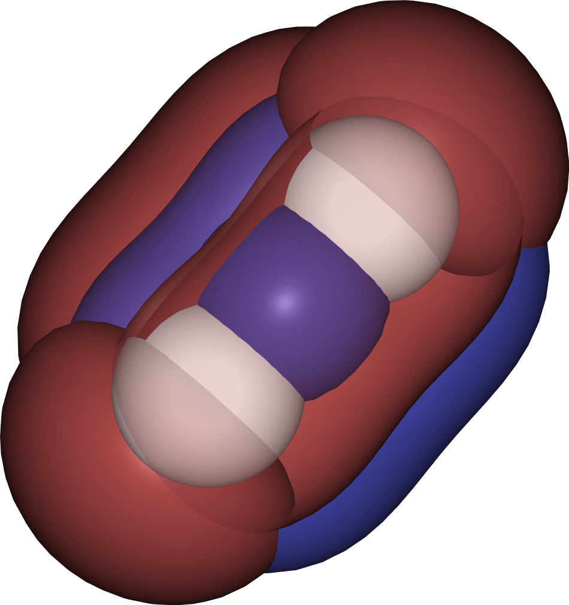
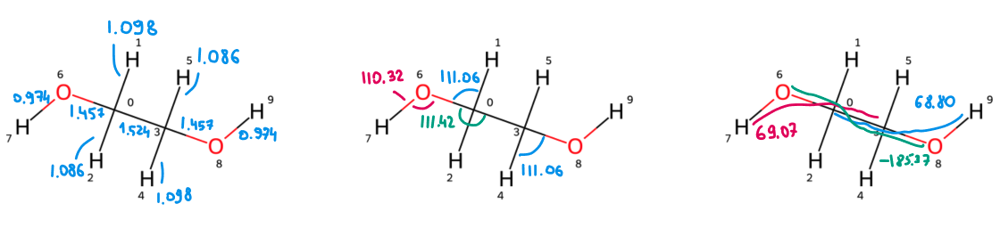

# Задание с семинара 1
**26.10.2023**

## Проблема
Для одной из предоставленных молекул рассчитать:
- Равновесную геометрию (равновесные длины связей и валентные углы)
- Вертикальный потенциал ионизации: по т. Купманса и по разностям рассчитанных энергий ионизированных состояний

Выбранные молекулы
1. N2
2. CO
3. Этиленгликоль

## Предложенные параметры запуска
Авторами курса предложены следующие команды для Orca
```
!B3LYP D3BJ 6-311G
!RIJCOSX AutoAux printbasis
!Opt Freq
!DEFGRID3 TightSCF
```
`B3LYP` – уровень теории для [DFT-вычислений](https://sites.google.com/site/orcainputlibrary/dft-calculations?authuser=0#h.uh21nstaojjo)

`D3BJ` – Becke-Johnson damping, [коррекция дисперсии](https://onlinelibrary.wiley.com/doi/10.1002/jcc.21759)

`6-311G` – базисный набор, предложен  6-31G, но решил взять больше функций для большей точности:
> Use the largest basis set you can afford to use for your computational project without straining resources unnecessarily or do a basis set convergence study. Discovering surprisingly large basis set errors in the end of a project is not fun but neither is to wait a long time for an unncessarily time-consuming calculation to finish (when a smaller basis set would have sufficed).
[Orca Input Library](https://sites.google.com/site/orcainputlibrary/basis-sets?authuser=0#h.ssci0okc2ue4)

`RIJCOSX AutoAux` – [настройки SVD](https://sites.google.com/site/orcainputlibrary/basis-sets/ri-and-auxiliary-basis-sets), какой дополнительный базис выбрать и как считать

`printbasis` – если использовались дополнительные базисы, то вывести в итоге тот, который изначально подразумевался (6-311G)

`Opt Freq` – оптимизировать геометрию и рассчитать частоты колебаний

`DEFGRID3 TightSCF` – [настройки точности](https://sites.google.com/site/orcainputlibrary/numerical-precision) вычислений и SCF

## Запуск
Для вычислений было создано по три входных файла для каждой молекулы: нейтральная, катион и анион, различия только в заряде и мультиплетности. Запуск производился с помощью скрипта [run_qm](./run_qm).

## Результаты
### Молекула азота
#### Геометрия
Для молекула азота есть только один геометрический параметр – длина связи, приведены изменения в процессе оптимизации

Шаг | N–N, *Å* | [N–N]+, *Å* | [N–N]–, *Å*
:---|--------|-----------|----------
0 | 1.50 | 1.50 | 1.50
1 | 1.34 | 1.34 | 1.34
2 | 1.18 | 1.18 | 1.18
3 | 1.03 | 1.21 | 1.24
4 | 1.13 | 1.20 | 1.22
5 | 1.12 | 1.20 | 1.22
6 | 1.11 | 1.20 | 1.22
7 | 1.11 |      |
8 | 1.11 |      |

Экспериментальное начение длины N–N: 1.098 *Å*



*Три верхних занятых орбитали молекулы азота, ядра показаны белым цветом, cutoff поверхностей: 0.1 (красная) и –0.1 (синяя).*

#### Энергии
Вертикальную энергию ионизации и сродство к электрону можно оценить по т. Купманса (энергии HOMO и LUMO для нейтральных молекул) и сравнив Sigle Point Energy молекулы с соответствующими ионами.

Энергия, *Eh* | N2  | [N2]+  | [N2]–
--------------|-----|--------|-------
SPE           | -109.451264901298 | -108.837767468533   | -109.374588637501
HOMO          | -0.424202         | |
LUMO          | -0.039729         | |
SPEi – SPE0   |                   | 0.613497432765 (IE) | 0.076676263797 (EA)

Результаты по теореме Купманса дают отличие по энергии в полтора раза, пока не понял, в какой части расчетов кроется ошибка (также не ясно, почему у LUMO-орбитали отрицательная энергия).

Энергия, *Eh* | Coopmans | dE ion
--------------|----------|--------
IE            | 0.424202 | 0.613497432765
EA            | 0.039729 | 0.076676263797

**Экспериментальное значение потенциала ионизации молекулы азота: 15.581 *эВ* (0.572591 *Eh*).**

### Молекула монооксида углерода
#### Геометрия
Также, как и для молекулы азота, у CO только одна связь:

Шаг | C–O, *Å* | [C–O]+, *Å* | [C–O]–, *Å*
:---|--------|-----------|----------
0 | 1.50 | 1.50 | 1.50
1 | 1.34 | 1.34 | 1.34
2 | 1.18 | 1.18 | 1.18
3 | 1.11 | 1.07 | 1.28
4 | 1.15 | 1.14 | 1.26
5 | 1.15 | 1.13 | 1.26
6 | 1.15 | 1.13 | 1.26
7 | 1.15 | 1.13 |

Экспериментальное значение длины C–O: 1.128 *Å*

#### Энергии
Энергия, *Eh* | CO | [CO]+ | [CO]–
--------------|-----|--------|-------
SPE           | -113.245439173750 | -112.726363236753 | -113.179713529905
HOMO          | -0.380707         | |
LUMO          | -0.045507         | |
SPEi – SPE0   |                   | 0.519075936997 (IE) | 0.065725643845 (EA)

Энергия, *Eh* | Coopmans | dE ion
--------------|----------|--------
IE            | 0.380707 | 0.519075936997
EA            | 0.045507 | 0.065725643845

Также видим, что разности энергий ионизированных состояний плохо совпадают с энергиями орбиталей.

**Экспериментальное значение потенциала ионизации молекулы монооксида углерода: 14.014 *эВ* (0.515005 *Eh*).**

### Молекула этиленгликоля
Молекула этиленгликоля сложнее предыдущих двухатомных молекул, поэтому если просто перечислить все длины связей, углы и двугранники, будет слишком много чисел, которые не понятно что показывают. Поэтому из гкометричкескх параметров я решил оставить:
- все длины связей (9)
- валентные углы, которые сильнее всего изменялись при оптимизации геометрии (4)
- по одному двуграннику на каждую вращающуюся связь (3)

#### Геометрия
Больше всего при оптимизации сместились гидроксильные атомы водорода, особенно это отразилось на двугранниках и соответствующих углах, длины связей оставались относительно стабильными.

| Шаг         |           0 |          10 |
|:------------|------------:|------------:|
| c0-h1, *Å*  |    1.09507  |    1.0979   |
| c3-o8       |    1.44     |    1.45673  |
| c3-h4       |    1.09507  |    1.09788  |
| c0-c3       |    1.52999  |    1.52444  |
| c0-o6       |    1.44     |    1.45684  |
| o6-h7       |    0.96613  |    0.973694 |
| c0-h2       |    1.09507  |    1.08636  |
| o8-h9       |    0.966131 |    0.973704 |
| c3-h5       |    1.09507  |    1.08635  |
| h4-c3-o8, ° |  107.494    |  111.056    |
| h1-c0-o6    |  107.494    |  111.056    |
| c3-c0-o6    |  111.383    |  111.425    |
| c0-o6-h7    |  108.999    |  110.322    |
| c3-c0-o6-h7, ° |  101.887    |   69.0673   |
| c0-c3-o8-h9 |   78.1128   |   68.8024   |
| o6-c0-c3-o8 | -180        | -185.368    |



Более подробный анализ с кодом – в [ноутбуке](geometry_analysis.ipynb).

#### Энергия
Энергия, *Eh* | EG | [EG]+ | [EG]–
--------------|-----|--------|-------
SPE           | -230.122773660470 | -229.779537203797 | -230.042776722666
HOMO          | -0.266742 |  |
LUMO          |  0.021834 |  |
SPEi – SPE0   |  | 0.343236456673 (IE) | 0.079996937804 (EA)

Энергия, *Eh* | Coopmans  | dE ion
--------------|-----------|--------
IE            |  0.266742 | 0.343236456673
EA            | -0.021834 | 0.079996937804

В данном вычислении плохо сошлась только энергия сродства с электроном – получился разный знак.

**Экспериментальное значение потенциала ионизации: 10.550 *эВ* (0.3877052 *Eh*)**
